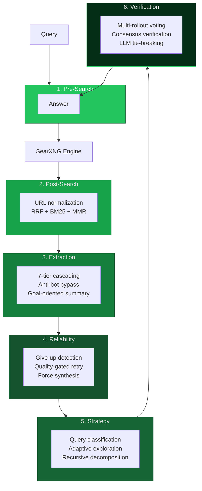

# browser-goat — Production-grade web search for AI agents

[](https://github.com/Im-Busy/browser-goat)
[](https://python.org)
[](LICENSE)
[](https://pypi.org/project/browser-goat)


> Six-stage search pipeline around SearXNG: query intent detection, hybrid BM25+MMR ranking, anti-bot content extraction, quality-gated retry, adaptive exploration, and multi-rollout consensus verification — running entirely on your own infrastructure.

## Why browser-goat?

SearXNG is powerful but raw — it returns search results, not answers. browser-goat wraps it with six processing layers that turn those results into verified, structured answers that AI agents can trust. Each layer ports specific innovations from SearchWala, local-deep-research, Marco-DeepResearch, Tongyi-DeepResearch, and Scrapling.


## Architecture



| Layer | What It Does | Source |
|-------|-------------|--------|
| **Pre-Search** | Intent detection (6 types), 20 browser profiles, CJK-aware parameters | SearchWala + Tongyi |
| **Post-Search** | URL normalization, RRF (k=60) + BM25+ + MMR (λ=0.7) | SearchWala |
| **Extraction** | 7-tier cascading, goal-oriented summaries, anti-bot bypass | SearchWala + Scrapling |
| **Reliability** | 43 give-up patterns, quality-gated retry, force synthesis | Marco + SearchWala |
| **Strategy** | Query classification, adaptive exploration, recursive decomposition | local-deep-research |
| **Verification** | Multi-rollout voting, consensus verification, LLM tie-breaking | Marco |


## Quick Start

### MCP (AI Agents)

```json
{
  "mcpServers": {
    "browser-goat": {
      "command": "npx",
      "args": ["browser-goat"],
      "env": { "SEARXNG_URL": "http://localhost:8080" }
    }
  }
}
```

Requires Python 3.13+ and a running SearXNG instance.

### CLI

```bash
uvx browser-goat search "latest AI research"
uvx browser-goat search "Python vs Rust" --strategy explore
uvx browser-goat extract "https://example.com/article"
```

Run `uvx browser-goat --guide` for full documentation.

### Library

```python
from browser_goat import BrowserGoat

meta = BrowserGoat(searxng_url="http://localhost:8080")
result = await meta.search("quantum computing")
print(result.answer)
```

## MCP Tools

| Tool | Description |
|------|-------------|
| `search` | Full pipeline: intent -> SearXNG -> ranking -> extraction -> reliability. Supports `time_range`, `max_sources`, `strategy`. |
| `extract` | Fetch and extract a single URL with anti-bot bypass (Cloudflare Turnstile). |

See [CLIENTS.md](CLIENTS.md) for platform-specific MCP configuration.

## Docker

```bash
docker compose up   # SearXNG at localhost:8080, API at localhost:8000
```

## Development

```bash
git clone https://github.com/Im-Busy/browser-goat.git && cd browser-goat && uv sync
uv run pytest                  # 304 tests
uv run ruff check src/ tests/  # zero violations
uv run mypy src/               # zero errors
```

## License

MIT
