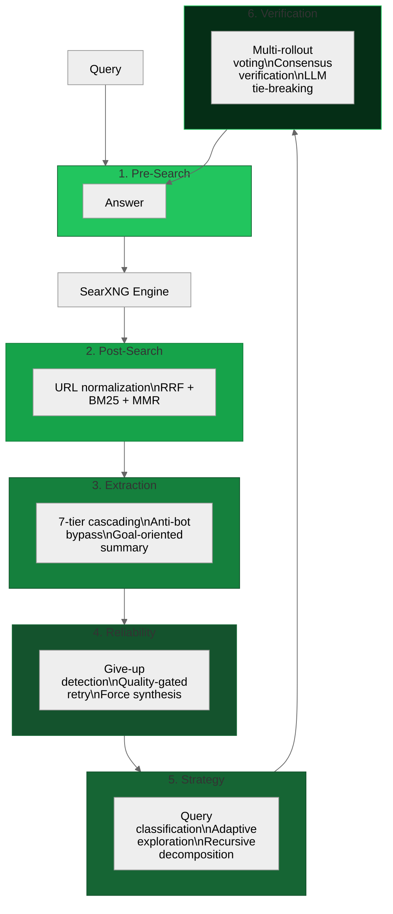

# browser-goat — Production-grade web search for AI agents

[](https://github.com/Im-Busy/browser-goat)
[](https://python.org)
[](LICENSE)
[](https://pypi.org/project/browser-goat)

> Six-stage search pipeline around SearXNG: query intent detection, hybrid BM25+MMR ranking, anti-bot content extraction, quality-gated retry, adaptive exploration, and multi-rollout consensus verification — running entirely on your own infrastructure.

[Quick Start](#quick-start) · [How to Use](#how-to-use) · [Architecture](#architecture) · [MCP Tools](#mcp-tools) · [Docker](#docker) · [Docs](#documentation) · [Development](#development)

## Quick Start

Requires Python 3.13+ and a running SearXNG instance. Run `uvx browser-goat --guide` for full documentation.

### MCP (AI Agents)

```json
{
  "mcpServers": {
    "browser-goat": {
      "command": "npx",
      "args": ["browser-goat"],
      "env": { "SEARXNG_URL": "http://localhost:8082" }
    }
  }
}
```

See [CLIENTS.md](CLIENTS.md) for platform-specific configuration (Claude Desktop, Cursor, OpenCode, GitHub Copilot, Windsurf).

### CLI

```bash
uvx browser-goat search "latest AI research"
uvx browser-goat search "Python vs Rust" --strategy explore
uvx browser-goat extract "https://example.com/article"
```

### Library

```python
from browser_goat import BrowserGoat

meta = BrowserGoat(searxng_url="http://localhost:8082")
result = await meta.search("quantum computing")
print(result.answer)
```

## How to Use

Each example is copy-paste ready. All require Docker Compose running (`docker compose up`).

```bash
# Basic search — fires all six pipeline stages automatically
uvx browser-goat search "latest AI research developments 2025"

# Factual query — intent detection identifies this as a Factual query
# and routes it through direct-answer optimization (no exploration overhead)
uvx browser-goat search "capital of France"

# Time-filtered — restricts SearXNG results to the past week
uvx browser-goat search "AI regulation news" --time-range week

# Deep research — enables adaptive exploration with recursive decomposition
uvx browser-goat search "quantum computing applications in drug discovery" --strategy explore

# High reliability — triggers multi-rollout verification and consensus voting
# (also try --reliability maximum for 8 rollouts with LLM tie-breaking)
uvx browser-goat search "clinical trial results for mRNA vaccines" --reliability high

# Extract a page — fetches and cleans any URL with anti-bot bypass
uvx browser-goat extract "https://en.wikipedia.org/wiki/Python_(programming_language)"

# Programmatic — same pipeline, accessible from Python
```python
from browser_goat import BrowserGoat

goat = BrowserGoat(searxng_url="http://localhost:8082")
result = await goat.search("Rust vs Go performance benchmarks 2025")
print(f"Answer: {result.answer}")
print(f"Sources: {len(result.sources)} pages — extraction_rate={result.extraction_success_rate}")
# Response shape: { answer, sources, query_intent, engines_used, reliability, verification, timestamp }
```

# MCP tool call — an AI agent invokes the search tool (conceptual)
# The agent sends: search(query="Rust vs Go", time_range="year", reliability_mode="high")
# browser-goat returns structured JSON with answer + sources + reliability + verification metadata
```

### Which Interface Should I Use?

| You are... | Use... | Because... |
|-----------|--------|-----------|
| An AI agent (Claude, Cursor, OpenCode) | **MCP** | Tools appear in the agent's tool list. Zero config beyond the JSON snippet. |
| Prototyping or scripting | **CLI** | `uvx browser-goat search "query"` — instant results, no code. |
| Building an application | **Library** | Full control over pipeline parameters, async integration, result parsing. |
| Running a service | **Docker** | `docker compose up` — SearXNG + browser-goat as a sidecar. |

**Skip browser-goat if** you only need raw search snippets (use SearXNG directly) or you're already happy with a managed API like Tavily or Exa. browser-goat adds overhead for a reason — if you don't need ranked, extracted, verified answers, the pipeline is more than you want.

## Why browser-goat?

SearXNG is powerful but raw — it returns search results, not answers. browser-goat wraps it with six processing layers that turn those results into verified, structured answers that AI agents can trust. Each layer ports specific innovations from SearchWala, local-deep-research, Marco-DeepResearch, Tongyi-DeepResearch, and Scrapling.

## Features

- **Self-hosted** — No API keys, no rate limits, no third-party dependency. Your SearXNG, your infrastructure.
- **Six processing layers** — Intent detection → SearXNG → Hybrid ranking (RRF + BM25 + MMR) → Content extraction → Quality-gated retry → Answer
- **Anti-bot bypass** — Cloudflare Turnstile solving via Scrapling. Pages that block scrapers work.
- **CJK language support** — Chinese, Japanese, and Korean queries route through appropriate search engines.
- **Multi-rollout verification** — Run 5–8 parallel searches, vote on consensus, verify ties with an LLM (optional).
- **Three interfaces, one engine** — MCP server for AI agents, CLI for scripting, Python library for integration.

## Architecture



| Layer | What It Does | Source |
|-------|-------------|--------|
| **Pre-Search** | Intent detection (6 types), 20 browser profiles, CJK-aware parameters | SearchWala + Tongyi |
| **Post-Search** | URL normalization, RRF (k=60) + BM25+ + MMR (λ=0.7) | SearchWala |
| **Extraction** | 7-tier cascading, goal-oriented summaries, anti-bot bypass | SearchWala + Scrapling |
| **Reliability** | 43 give-up patterns, quality-gated retry, force synthesis | Marco + SearchWala |
| **Strategy** | Query classification, adaptive exploration, recursive decomposition | local-deep-research |
| **Verification** | Multi-rollout voting, consensus verification, LLM tie-breaking | Marco |

## Configuration

| Variable | Default | Description |
|----------|---------|-------------|
| `SEARXNG_URL` | `http://localhost:8082` | SearXNG instance URL |
| `BROWSER_GOAT_LLM` | (none) | LLM for verification tie-breaking. Format: `openai:gpt-4o-mini` or `ollama:llama3`. Optional — voting works without it. |
| `BROWSER_GOAT_OPENAI_API_KEY` | (none) | API key when using `BROWSER_GOAT_LLM=openai:*` |
| `BROWSER_GOAT_OLLAMA_HOST` | `http://localhost:11434` | Ollama host when using `BROWSER_GOAT_LLM=ollama:*` |

## Compared to Alternatives

| Tool | browser-goat | Raw SearXNG | Tavily / Exa |
|------|:---:|:---:|:---:|
| Self-hosted | ✅ Your infrastructure | ✅ Your infrastructure | ❌ API service |
| Structured answers | ✅ Full pipeline output | ❌ Returns search snippets | ✅ API returns structured data |
| Multi-source verification | ✅ Consensus voting across rollouts | ❌ | ❌ |
| Anti-bot bypass | ✅ Scrapling + Playwright | ❌ | ✅ Proprietary |
| Rate limits | None | Your SearXNG config | Tiered plans |
| API key required | No | No | Yes |

## MCP Tools

| Tool | Description |
|------|-------------|
| `search` | Full pipeline: intent -> SearXNG -> ranking -> extraction -> reliability. Supports `time_range`, `max_sources`, `strategy`, `reliability_mode`. |
| `extract` | Fetch and extract a single URL with anti-bot bypass (Cloudflare Turnstile). |
| `verify` | Run multi-rollout verification on a claim by issuing parallel searches and voting on consensus. |

See [CLIENTS.md](CLIENTS.md) for platform-specific MCP configuration snippets.

## Docker

```bash
docker compose up   # SearXNG at localhost:8082, API at localhost:8003
```

## Documentation

Run `uvx browser-goat --guide` for the built-in usage reference.

For MCP integration across Claude Desktop, Cursor, OpenCode, GitHub Copilot, and Windsurf, see [CLIENTS.md](CLIENTS.md). Architecture details and design decisions live in [developer_docs/](developer_docs/).

## Development

```bash
git clone https://github.com/Im-Busy/browser-goat.git && cd browser-goat && uv sync
uv run pytest                  # 304 tests
uv run ruff check src/ tests/  # zero violations
uv run mypy src/               # zero errors
```

## License

MIT
