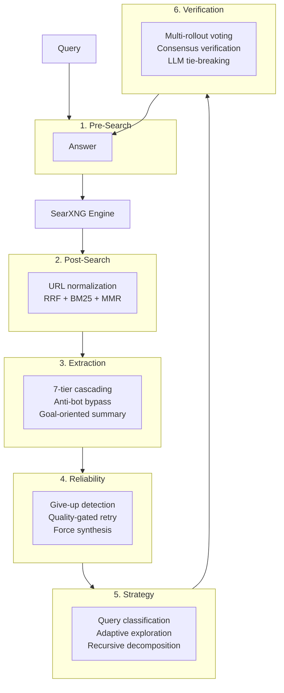

# browser-goat — Production-grade web search for AI agents.

[](https://github.com/Im-Busy/browser-goat)
[](https://python.org)
[](LICENSE)

> Six-stage search pipeline around SearXNG: query intent detection, hybrid BM25+MMR ranking, anti-bot content extraction, quality-gated retry, adaptive exploration, and multi-rollout consensus verification — running entirely on your own infrastructure.



---

## Quick Start

### MCP (AI Agents)

```json
{
  "mcpServers": {
    "browser-goat": {
      "command": "npx",
      "args": ["browser-goat"],
      "env": { "SEARXNG_URL": "http://localhost:8080" }
    }
  }
}
```

Requires Python 3.13+ and a running SearXNG instance.

### CLI

```bash
uvx browser-goat search "latest AI research"
uvx browser-goat search "Python vs Rust" --strategy explore
uvx browser-goat extract "https://example.com/article"
```

### Library

```bash
pip install browser-goat
```

```python
from browser_goat import BrowserGoat

meta = BrowserGoat(searxng_url="http://localhost:8080")
result = await meta.search("quantum computing")
print(result.answer)
```

---

## MCP Tools

| Tool | Description |
|------|-------------|
| `search` | Full pipeline: intent analysis → SearXNG → ranking → extraction → reliability. Supports `time_range` (day/week/month/year), `max_sources`, and `strategy` (default/auto/explore/decompose). |
| `extract` | Fetch and extract a single URL with anti-bot bypass (Cloudflare Turnstile). Returns title, clean text, and extraction tier. |

---

## Client Configuration

### Claude Desktop

```json
{
  "mcpServers": {
    "browser-goat": {
      "command": "uvx",
      "args": ["browser-goat-mcp", "--searxng-url", "http://localhost:8080"]
    }
  }
}
```

### Cursor / VS Code

```json
{
  "mcpServers": {
    "browser-goat": {
      "command": "npx",
      "args": ["browser-goat"],
      "env": { "SEARXNG_URL": "http://localhost:8080" }
    }
  }
}
```

---

## Docker

Bundled SearXNG + Redis sidecar deployment:

```bash
docker compose up
```

SearXNG starts at `localhost:8080`, browser-goat API at `localhost:8000`.

```bash
docker exec browser-goat uv run browser-goat search "your query"
```

---

## How It Works

Each search passes through six layers before returning an answer. The diagram above shows the full pipeline. Layers 1-4 run on every query; Layers 5-6 activate when `--strategy` or `--reliability` are set.

---

## Development

```bash
git clone https://github.com/Im-Busy/browser-goat.git
cd browser-goat
uv sync

uv run pytest                  # 304 tests (287 unit + 17 integration)
uv run ruff check src/ tests/  # zero violations
uv run mypy src/               # zero errors
```

Tests require SearXNG at `localhost:8080`. Skip integration tests:

```bash
uv run pytest -m "not integration"
```

---

## License

MIT
