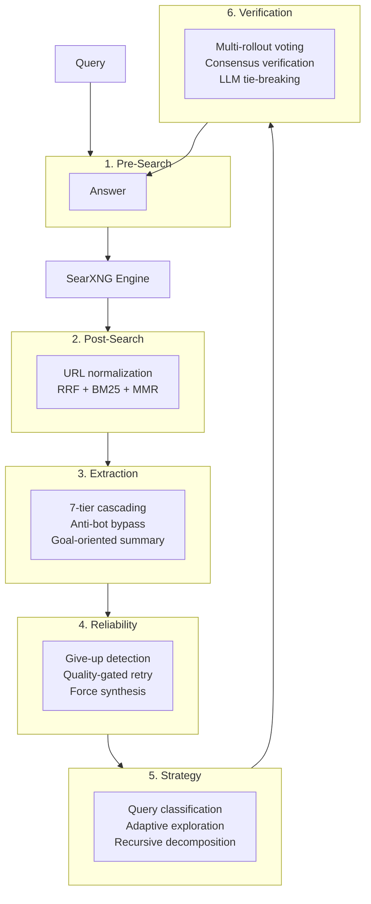

# Architecture

When you run a search, browser-goat processes your query through six stages before returning an answer:

### 1. Pre-Search — Understanding Your Query

Before sending anything to SearXNG, browser-goat analyzes your query to detect intent (factual? comparison? how-to?), determines time sensitivity, and detects language. It also rotates browser-like headers so downstream engines don't block automated requests.

### 2. Post-Search — Ranking and Cleaning

Raw results from SearXNG are ranked using a hybrid approach combining multiple relevance signals. URLs are normalized, tracking parameters are stripped, and duplicates are removed. The result is a clean, ranked list.

### 3. Extraction — Getting the Content

Each result URL is fetched and its content extracted. browser-goat handles anti-bot challenges, parses structured data where available, and produces a clean summary. You get the actual page content, not just a snippet.

### 4. Reliability — Quality You Can Trust

Low-quality or empty answers are detected and automatically retried with adjusted parameters. If multiple attempts still produce insufficient results, browser-goat synthesizes the best available information rather than returning nothing.

### 5. Strategy — Smarter Searches

For complex queries, browser-goat can classify the question type, explore multiple search angles in parallel, or decompose the query into subtasks. Each approach produces richer, more complete answers for research-heavy questions.

### 6. Verification — Consensus You Can Rely On

Multiple searches can be run in parallel with slight parameter variations. Results are compared, and a consensus answer is produced. When searches disagree, an additional verification step breaks the tie.

